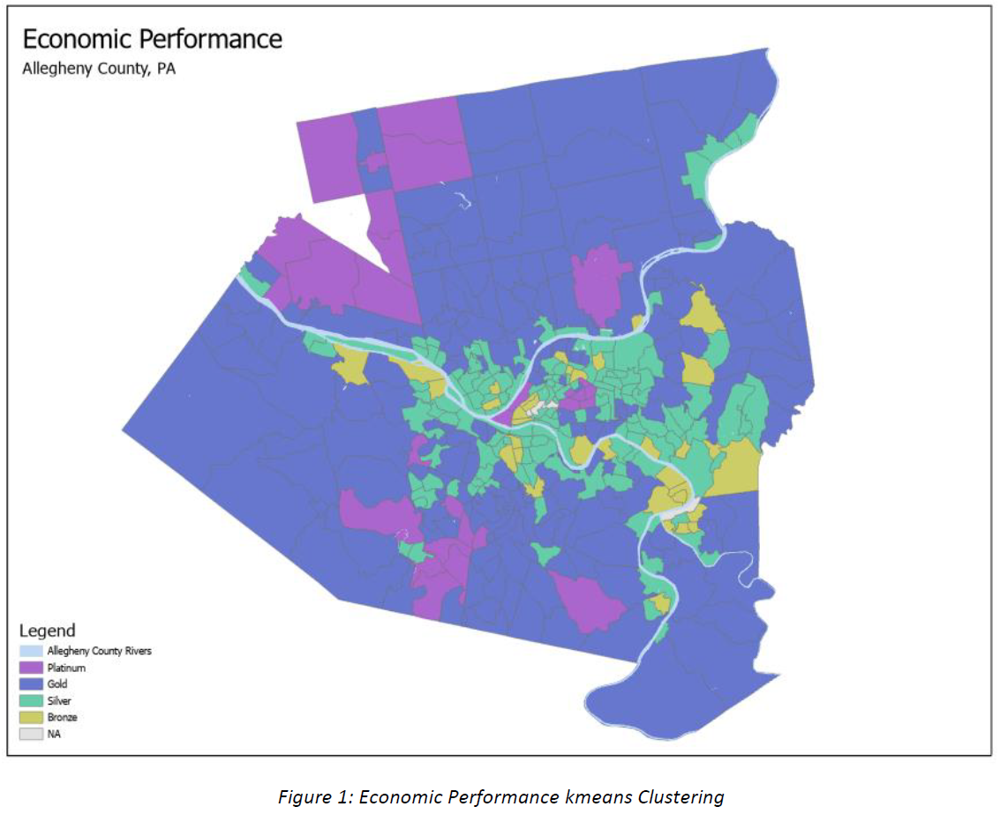
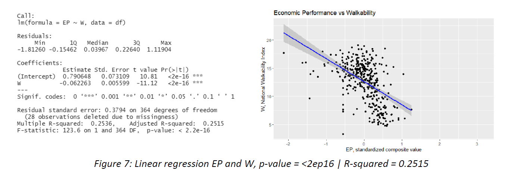

# Geographic Information System Project

The project was the final outcome from a class in Geographic Information System (GIS), where I learned to use [ArcGIS](https://www.arcgis.com/index.html). The project is a perfect representation of the skills and tools required to be successful in this field. The project required: extracting data from public websites, merging data from silo'd systems by primary keys, cleaning errors from merge discrepencies, transforming data into database structures ready for machine learning, loading into software (ArcGIS and Python), executing exploratory data analysis, implementing machine learning (clustering) models, and producing actionable insights.

 

|Category       |Value                                                                              |
|---------------|-----------------------------------------------------------------------------------|
|Article: |[Allegheny County’s relationship between economic performance and social equity, and the influence of walkability](https://bmripper.github.io/Allegheny_PA_relationship_EP_SE_walk.pdf)|
|Author:        |Ripperger, Brent                                                                   |
|Date Submitted:|30 April 2022                                                                      |

### Abstract

This project explored the relationship between economic performance (EP), social equity (SE), and walkability (W). The purpose was to answer the question: does walkability explain why certain census tracts both have high EP and high SE while other tracts have high EP but low SE. The project analyzed census tracts inside Allegheny County using data from the US Census Bureau, Environmental Protection Agency (EPA), and Western Pennsylvania Regional Data Center (WPRDC). The hypothesis is that high walkability is associated with places of high EP and high SE, while low walkability is associated with places of high EP and low SE. However, the results show the opposite being true. This analysis found that SE is negatively correlated with EP (𝑝𝑣𝑎𝑙𝑢𝑒 = <2𝑒−16,𝑅𝑠𝑞𝑢𝑎𝑟𝑒𝑑 = 0.19). Similarly, walkability is negatively correlated with EP (𝑝𝑣𝑎𝑙𝑢𝑒= <2𝑒−16,𝑅𝑠𝑞𝑢𝑎𝑟𝑒𝑑= 0.25). Considering both SE and W were negatively correlated with EP, there becomes a need to understand the relationship between W and SE. This analysis found that walkability is positively correlated with SE (𝑝𝑣𝑎𝑙𝑢𝑒 = 0.000218,𝑅𝑠𝑞𝑢𝑎𝑟𝑒𝑑 = 0.034). While the R-squared value is small, the implications for this are interesting and surprising. The positive relationship between W and SE justifies the need for further analysis by policy makers. These findings could provide the rationale to improve the walkability of targeted census tracts, expecting to drive an increase in SE. While the project didn’t prove that higher walkability explains why tracts have both high EP and high SE, the project was able to find a statistically significant, positive correlation between walkability and social equity.

### Example GIS Visual: Economic Performance

Image shows the kmeans cluster analysis results. The economic performance clusters are displayed below. The cluster used 10 variables: median household income, median sale price, variance sale price 2017 to 2019, % owner occupied homes, foreclosures, % poor condition homes, % homes with violations after inspection, new parcels created, vacancy rates, and subsidized homes. Figure 1 shows the cluster results by census tract.

### Example Linear Regression: Predict Walkability with Economic Performance metric

The image shows the linear regression results using economic performance metric to predict walkability by census tract. Referring to Figure 7, similar findings were found between W being negatively correlated with EP, p-value = <2e-16 and R-squared = 0.2515. The results indicate that the higher the economic performance, the lower the walkability.

